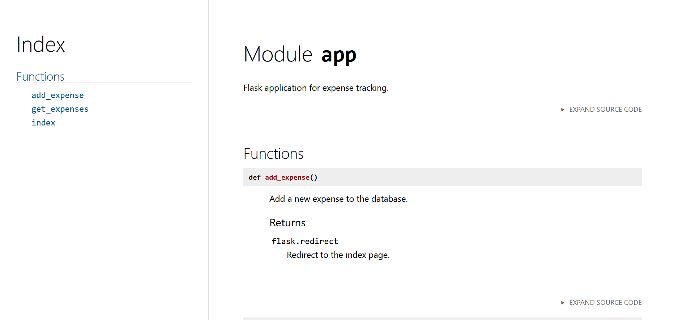
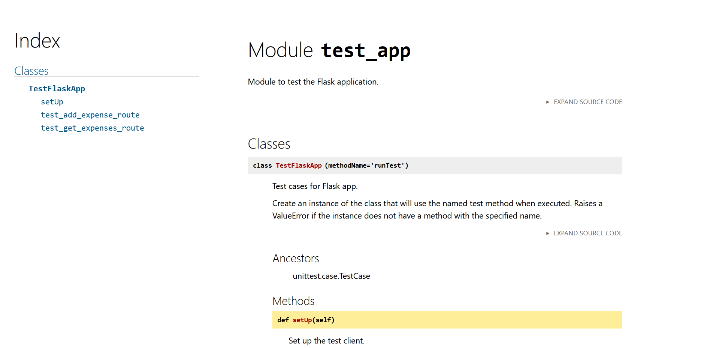

# gitlab-project

***
## Name
Deployment and Configuration of a Web Application using GitLab CI/CD

## Description
This repository contains the setup and configuration files necessary for deploying and automating the continuous integration and continuous deployment (CI/CD) pipeline for a web application using GitLab CI/CD.
## Pipeline Stages

### LINTING
Use of Python tools to automate code formatting, enforce PEP8 coding standards.

### BUILD
Builds base image, Builds a Docker image for the application, and pushes to Artifact Registry.

### TEST
Executes unit tests using Pytest, performs container scanning, Static Application Security testing, secret detection.

### STAGING
Deploying to Staging environment. Staging server is a Google Cloud Virtual Machine.

### PRODUCTION
Trigger a manual action before deployment to Production server, which is a Google Cloud Virtual Machine.

### FINISH
Executes cleanup tasks, such as removing unused Docker resources, after the main pipeline execution.

## Badges

## Visuals

## API Documentation

You can find the App Module API documentation in the [App module API](http://apidocumentationgitlab.s3-website-us-east-1.amazonaws.com/) file.

Here is a sample screeshot of the App Module API documentation.

You can find the Test-app Module API documentation in the [Test_App module API](http://apidocumentationgitlab2.s3-website-us-east-1.amazonaws.com) file.
Here is a sample screeshot of the Test-App Module API documentation.

## Installation
Docker installed on the development environment to run the application.

For development, install Python (Python 3.11.4 or up recommended)

If you are using using GitLab CICD and wants to setup your own runner, follow these steps:
[Create and register a project runner](https://docs.gitlab.com/ee/tutorials/create_register_first_runner/#create-and-register-a-project-runner)

In addition to the installations, if you also need a [Google Cloud Project](https://console.cloud.google.com/) and [MongoDB Atlas](https://www.mongodb.com/products/platform/cloud) account and database ready to use.

## Support
If you need assistance or have any questions, feel free to reach out through one of the following channels:

Chat Room: Join our community chat room on [Slack](https://join.slack.com/t/slack-wjn8365/shared_invite/zt-2h52ilcgi-N330_9FXPN9S6ittxT4fYg) to interact with other users and developers.

Email: For inquiries or support requests, you can email us at support@gitlabcicd.com.

## Roadmap
For future releases

Enhance testing capabilities and ensure high code quality.

Improve deployment orchestration and implement rollback mechanisms for error handling.

Integrate DAST scans into deployment pipelines for continuous security testing.

Blue-Green Deployment:
Implement blue-green deployment strategy for zero-downtime deployments.
Automate switching between active and inactive environments.

Rollback Automation:
Develop automated rollback mechanisms to revert deployments in case of failures.
Implement version control and tagging for easier rollback management.

## Authors and acknowledgment

Project Leaders & Maintainers:

- [Ederlinda Reyla](https://gitlab.com/C0884805) (core team)
- [Gayathri Jayakumar](https://gitlab.com/gayathri_jk) (core team)
- [Sheena Dumbrique](https://gitlab.com/sheezzz) (core team)
- [Sheruby Mondero](https://gitlab.com/Sheruby) (core team)

Acknowledgments:
Special thanks to [Mr. Amir Samiezadeh](https://gitlab.com/amirsmz) for the valuable insights and support in developing this project.

## Project status
Our project has met all the required objectives. While additional enhancements are optional, we welcome any feedback you may have. Feel free to reach out to us via our [Slack Channel](https://join.slack.com/t/slack-wjn8365/shared_invite/zt-2h52ilcgi-N330_9FXPN9S6ittxT4fYg) to share your thoughts. Moreover, we encourage you to fork the project and implement your own modifications. Don't hesitate to share your updates on the Slack channel for community support.
